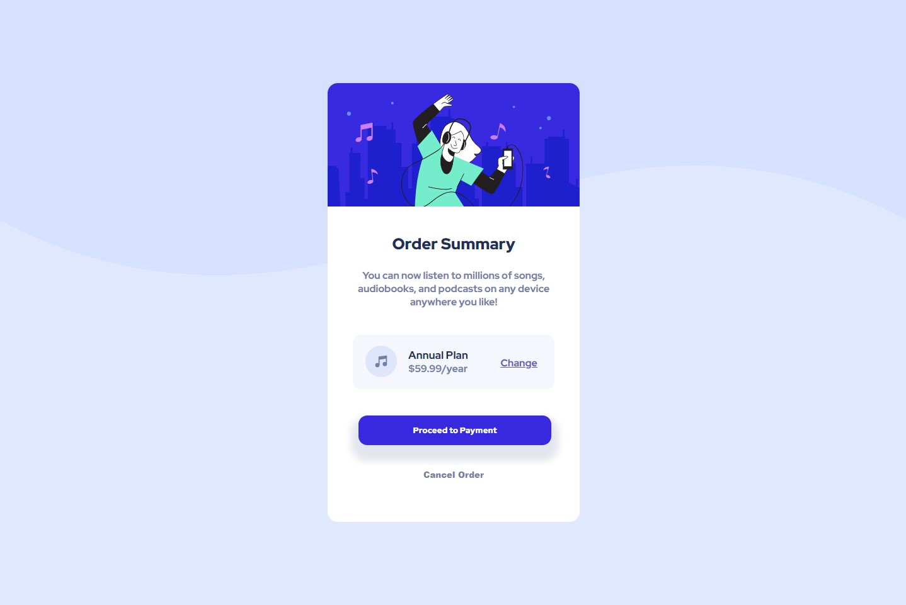

# Frontend Mentor - Order summary card

## The challenge

This challenge is to build order summary card component and make it look as close as possilbe 

In this project I use visual studio code and opera browser and I tried my best to make it look as close as possible.

I use Flex box as the layout manager of myproject.

**I really have fun building this project** 🚀

https://natyyg.github.io/Order-summary-frontend-mentor/